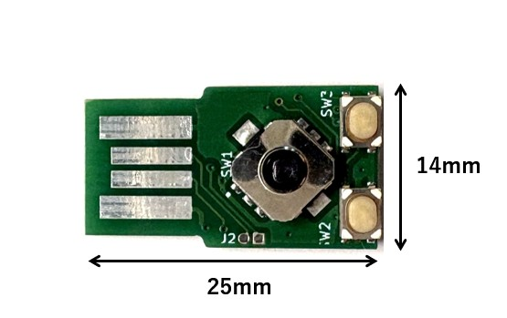
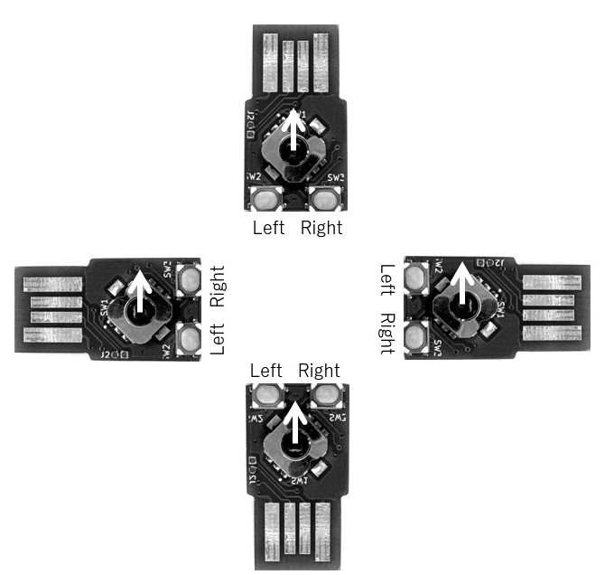
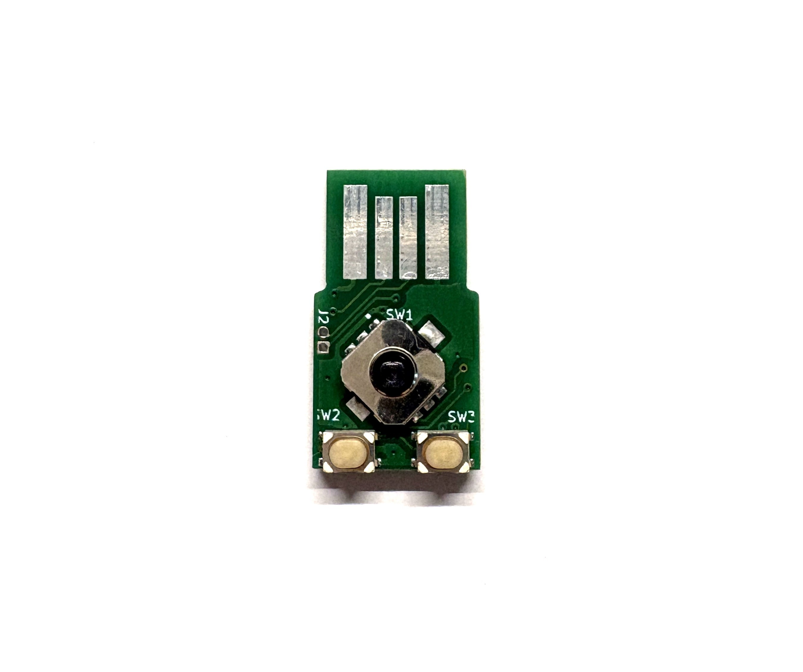
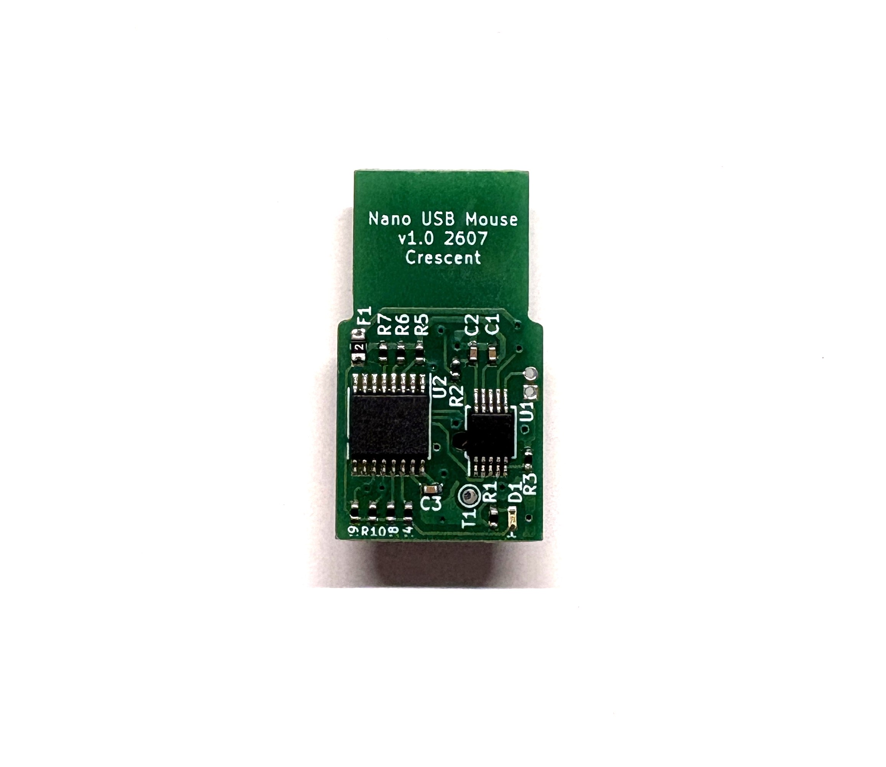
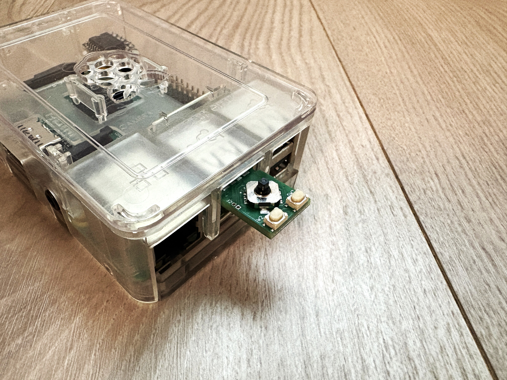

# Overview
  * This is a compact mouse equipped with 5 directional pad, size 14mm x 25mm.  
  * It features up, down, left, right, center buttons, and left/right click buttons.
  * The center button functions the same as the left mouse button.  
  * If you continue to tilt the knob, the speed changes in two stages.  
  * Suitable for small PCs and SBCs(Single Board Computers, like Raspberry Pi).   
  * It operates using standard drivers, without the need for a dedicated driver.   
  * You can change the mouse orientation according to the direction of the USB port.  

  

# Direction Setting
  * To configure the mouse orientation, insert the USB connector while holding the knob tilted in the desired "up" direction.   
  * The settings will be applied immediately.
  * If the settings are not applied, please perform the procedure again.  
  * The configuration data is automatically saved to flash memory.   
  * The orientation does not need to be set again for subsequent uses.  
  * The configuration data supports up to approximately 10,000 rewrite cycles.  
  * If you do not wish to change the orientation, connect this device to the USB port without pressing any buttons.  
 
  

# Target user
  * It is ideal for users who primarily use a keyboard and don't need a mouse, but still want to use one occasionally.  
  * It is ideal as a stopgap measure until the drivers for the mouse pad or touch panel are installed.
    
# Note
  * Due to the use of up, down, left, and right buttons, diagonal movement is not possible.  
  * Please take care not to short-circuit or damage components on the back of the board.    
  * Please operate the knob gently. Operating it with excessive force may cause damage.  
  * PCB color, LED color, and other specifications are subject to change without notice.  
## Appearance and examples

